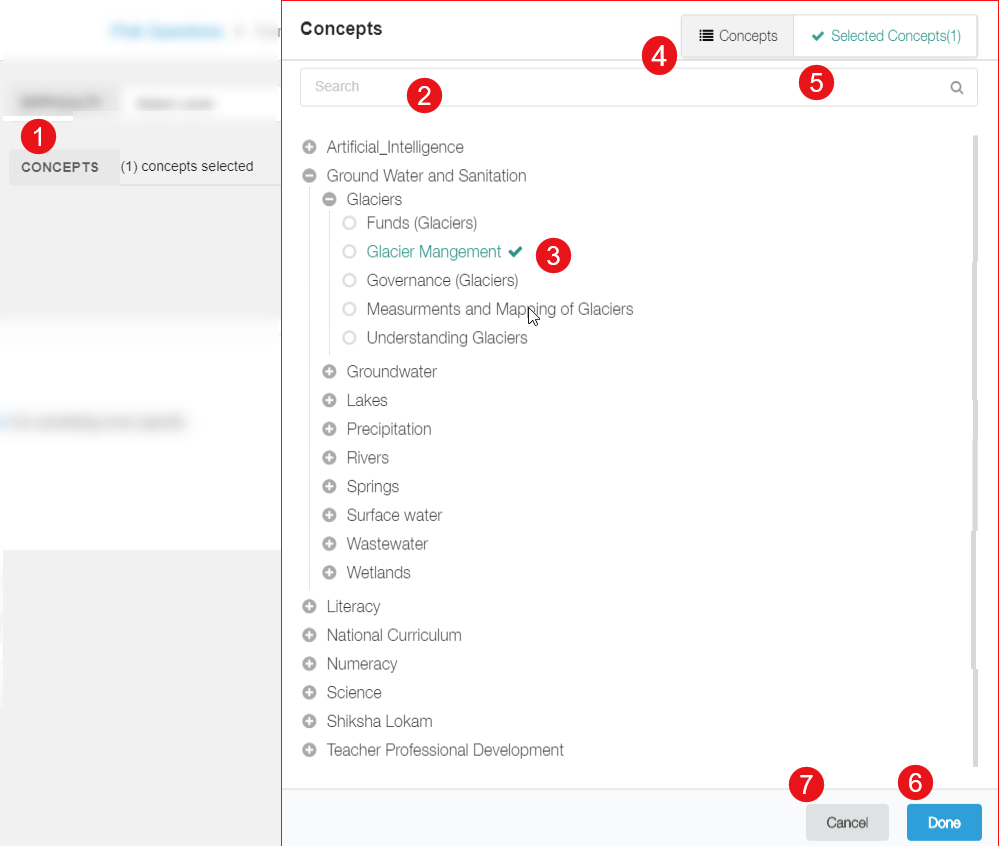

## Overview

The concept selector ensure that the content is establishes correct channel in the conceptulization tree

<table>
  <tr>
    <th style="width:35%;">Step</th>
    <th style="width:65%;">Screen</th>
  </tr>  
  <tr>
    <td>1 Click <b>Concepts</b>. The Concepts pop-up appears
     2. Search the concept using <b>Search</b> bar
     3. Select the concept(s) from the concept tree
     4. Concept tab displays complete list of the available concepts in Sunbird
     5. <b>Selected Concepts</b> displays the concepts that are selected
     6. Click <b>Done</b> to proceed
     7. Click <b>Cancel</b> to go back to previous page
    </td> 
    <td></td>
  </tr>
  </table>
